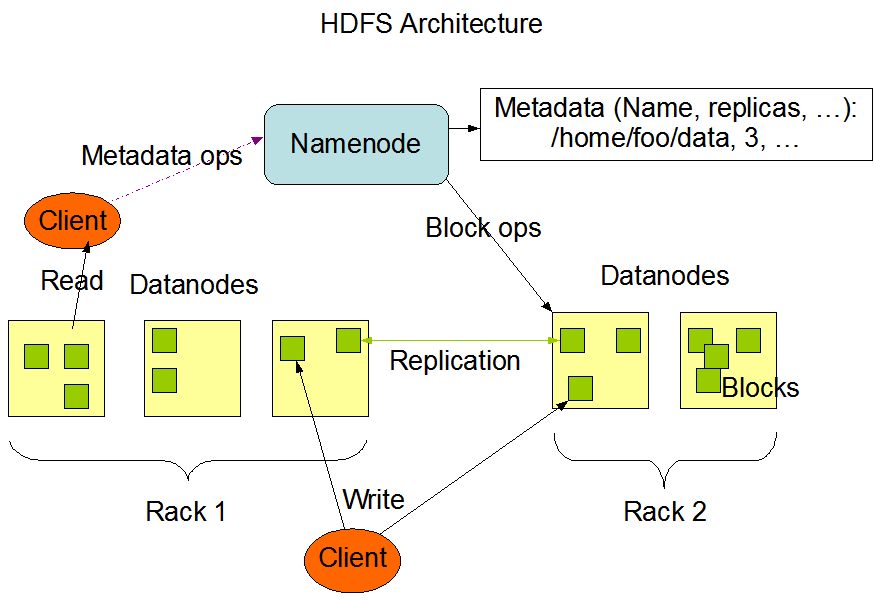

# Big-Data-for-DevOps-Engineers

  

## Big Data

<b><i>1.Explain what is exactly Big Data.</i></b>

$\color{green}{\text{Answer}}$

Doug Laney defined Big Data through the framework of the "V's," highlighting that it encompasses extremely large volumes of data arriving at varying velocities—from real-time streams to traditional batches—and in a wide variety of structured, semi-structured, and unstructured forms, all while presenting challenges in veracity and variability due to inconsistent, fluctuating, or sometimes inaccurate data quality.

1. <b>Volume</b>: The sheer scale of the information, involving extremely large amounts of data that outgrow traditional storage solutions.
   
2. <b>Velocity</b>: The speed at which data is generated and processed, ranging from periodic batches to continuous, real-time streams.
   
3. <b>Variety</b>: The diverse formats of the data, which can be structured (highly organized tables), semi-structured (like XML or JSON files), or unstructured (such as video, audio, and social media posts).
   
4. <b>Veracity or Variability</b>: The unpredictability of the data, referring to its fluctuating speeds and formats (variability) as well as the trustworthiness, accuracy, and consistency of the information itself (veracity).

<b><i>2.What is DataOps? How is it related to DevOps?</i></b>

$\color{green}{\text{Answer}}$

DataOps seeks to reduce the end-to-end cycle time of data analytics, from the origin of ideas to the literal creation of charts, graphs and models that create value. DataOps combines Agile development, DevOps and statistical process controls and applies them to data analytics.

<b><i>3.What is Data Architecture?</i></b>

$\color{green}{\text{Answer}}$

Data architecture is the process of standardizing how organizations collect, store, transform, distribute, and use data. The goal is to deliver relevant data to people who need it, when they need it, and help them make sense of it.

<b><i>4.Explain the different formats of data.</i></b>

$\color{green}{\text{Answer}}$

1. <b>Structured</b> - data that has defined format and length (e.g. numbers, words)

2. <b>Semi-structured</b> - Doesn't conform to a specific format but is self-describing (e.g. XML, SWIFT)

3. <b>Unstructured</b> - does not follow a specific format (e.g. images, test messages)

<b><i>5.What is a Data Warehouse?</i></b>

$\color{green}{\text{Answer}}$

A data warehouse is a central repository of information that can be analyzed to make more informed decisions. Data flows into a data warehouse from transactional systems, relational databases, and other sources, typically on a regular cadence. Business analysts, data engineers, data scientists, and decision makers access the data through business intelligence (BI) tools, SQL clients, and other analytics applications.

<b><i>6.What is Data Lake?</i></b>

$\color{green}{\text{Answer}}$

A data lake is a system or repository of data stored in its natural, raw format, usually object blobs or files. 

A data lake is usually a single store of data including raw copies of source system data, sensor data, social data etc., and transformed data used for tasks such as reporting, visualization, advanced analytics, and machine learning. 

A data lake can include structured data from relational databases (rows and columns), semi-structured data (CSV, logs, XML, JSON), unstructured data (emails, documents, PDFs), and binary data (images, audio, video).

A data lake can be established on premises (within an organization's data centers) or in the cloud (using cloud services).

<b><i>7.Can you explain the difference between a data lake and a data warehouse?</i></b>

$\color{green}{\text{Answer}}$

Data Lake: Stores vast amounts of raw, unstructured, and semi-structured data (like logs, images, and sensor feeds) in its native format. It uses a schema-on-read approach, meaning the data is only structured and cleaned when it is ready to be analyzed. It is highly flexible and ideal for data scientists running machine learning models.

Data Warehouse: Stores highly structured, filtered, and processed data that has already been cleaned and optimized for a specific purpose. It uses a schema-on-write approach, meaning the structure must be defined before the data is loaded. It is ideal for business analysts running predefined reports and dashboards.

<b><i>8.What is "Data Versioning"? What models of "Data Versioning" are there?</i></b>

$\color{green}{\text{Answer}}$

Data Versioning is the practice of tracking and managing changes to datasets over time, similar to how source code is managed in software development. It allows you to save "snapshots" of your data so you can audit changes, reproduce machine learning models, or roll back to an older dataset if something breaks.

Models of Data Versioning: 

1. File-Level/Object-Level Model: Tracks changes to raw files or objects in cloud storage. Every time a file changes, a new copy or a delta is saved under a unique version ID.
   - Tools: AWS S3 Versioning, DVC (Data Version Control).

2. Table-Level / Time-Travel Model: Tracks changes directly inside structured databases or open table formats. It allows you to run queries on data exactly as it existed at a specific timestamp or commit ID.
   - Tools: Delta Lake, Apache Iceberg, Apache Hudi.

3. Git-like / Branching Model: Applies full software engineering workflows directly to data. You can create branches to experiment on a dataset, test changes in isolation, and merge them back into production without duplicating the underlying storage.
   - Tools: LakeFS, Nessie.

4. System-of-Record / Application Model: The versioning logic is built directly into the database architecture using special timestamp columns (like tracking a "valid from" and "valid to" time for every row).
   - Concepts: Bi-temporal modeling, Slowly Changing Dimensions (SCD Type 4).

<b><i>9.What is ETL?</i></b>

$\color{green}{\text{Answer}}$

ETL stands for Extract, Transform, Load. It is a core data integration process used in Big Data and data warehousing to consolidate data from multiple sources into a single, centralized destination.

1. Extract: Raw data is gathered and pulled from various source systems, such as relational databases, CRM software, API feeds, or flat files.

2. Transform: The extracted data is cleaned, formatted, and processed. This involves removing duplicates, fixing errors, filtering out unwanted data, and organizing it so it matches the structure of the target system.

3. Load: The newly cleaned and structured data is written into its final destination—typically a data warehouse—where it can be used for business intelligence, reporting, and analysis.

The Modern Twist (ELT): With the rise of powerful cloud data platforms, many organizations now use ELT, where data is loaded into the destination immediately after extraction, and the transformation step happens directly inside the target system using its native processing power.

## Apache Hadoop

<b><i>10.Explain what is Hadoop.</i></b>

$\color{green}{\text{Answer}}$

Apache Hadoop is a collection of open-source software utilities for reliable, scalable, distributed computing. It provides a software framework for distributed storage and processing of big data using the MapReduce programming model. 

Hadoop was originally designed for computer clusters built from commodity hardware, which is still the common use. It has since also found use on clusters of higher-end hardware.

All the modules in Hadoop are designed with a fundamental assumption that hardware failures are common occurrences and should be automatically handled by the framework.

<b><i>11.Explain Hadoop YARN.</i></b>

$\color{green}{\text{Answer}}$

Responsible for managing the compute resources in clusters and scheduling users' applications.

<b><i>12.Explain Hadoop MapReduce.</i></b>

$\color{green}{\text{Answer}}$

A programming model for large-scale data processing.

<b><i>13.Explain Hadoop Distributed File Systems (HDFS).</i></b>

$\color{green}{\text{Answer}}$

- Distributed file system providing high aggregate bandwidth across the cluster.

- For a user it looks like a regular file system structure but behind the scenes it's distributed across multiple machines in a cluster

- Typical file size is TB and it can scale and supports millions of files

- It's fault tolerant which means it provides automatic recovery from faults

- It's best suited for running long batch operations rather than live analysis

<b><i>14.What do you know about HDFS architecture?</i></b>

$\color{green}{\text{Answer}}$

  

Master-slave architecture

Namenode - master, Datanodes - slaves

Files split into blocks

Blocks stored on datanodes

Namenode controls all metadata

